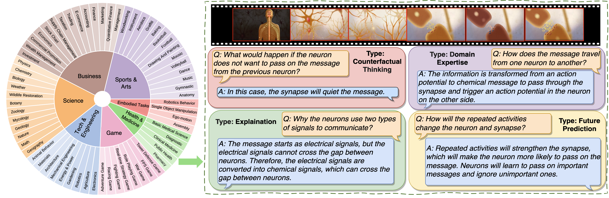

# MMWorld: Towards Multi-discipline Multi-faceted World Model Evaluation in Videos

[Xuehai He](https://sheehan1230.github.io/)<sup style="color: #FFB6C1;">†,1</sup>, [Weixi Feng*](https://weixi-feng.github.io/)<sup style="color: #ADD8E6;">2</sup>, [Kaizhi Zheng*](https://kzzheng.github.io/)<sup style="color: #FFB6C1;">1</sup>, [Yujie Lu*](https://yujielu10.github.io/)<sup style="color: #ADD8E6;">2</sup>, [Wanrong Zhu*](https://wanrong-zhu.com/)<sup style="color: #ADD8E6;">2</sup>, [Jiachen Li*](https://sites.google.com/view/jiachenli/)<sup style="color: #ADD8E6;">2</sup>, [Yue Fan*](http://www.yfan.site/)<sup style="color: #FFB6C1;">1</sup>, [Jianfeng Wang](https://scholar.google.com/citations?user=vJWEw_8AAAAJ&hl=en)<sup style="color: #90EE90;">3</sup>, [Linjie Li](https://www.linkedin.com/in/linjie-li/)<sup style="color: #90EE90;">3</sup>, [Zhengyuan Yang](https://zyang-ur.github.io/)<sup style="color: #90EE90;">3</sup>, [Kevin Lin](https://sites.google.com/site/kevinlin311tw/me)<sup style="color: #90EE90;">3</sup>, [William Yang Wang](https://sites.cs.ucsb.edu/~william/)<sup style="color: #ADD8E6;">2</sup>, [Xin Eric Wang](https://eric-xw.github.io/)<sup style="color: #FFB6C1;">†,1</sup>


<sup style="color: #FFB6C1;">1</sup>UCSC, <sup style="color: #FFB6C1;">2</sup>UCSB, <sup style="color: #FFB6C1;">3</sup>Microsoft

<sup style="color: #FFB6C1;">*</sup>Equal contribution

<a href='https://arxiv.org/abs/2406.08407'></a> <a href='https://mmworld-bench.github.io/'></a> <a href='https://huggingface.co/datasets/Xuehai/MMWorld'></a>



## TODO
- [x] Release dataset
- [x] Release evaluation code  
- [ ] EvalAI server setup

## :fire: News
* **[2024.07.1]** We add the evaluation toolkit.
* **[2024.06.12]** We release our dataset.


## Dataset Structure
The dataset can be downloaded from Huggingface.
Each entry in the dataset contains the following fields:
- `video_id`: Unique identifier for the video. Same as the relative path of the downloaded video
- `video_url`: URL of the video
- `discipline`: Main discipline of the video content
- `subdiscipline`: Sub-discipline of the video content
- `captions`: List of captions describing the video content
- `questions`: List of questions related to the video content, each with options and correct answer


## Example Entry

```json
{
  "video_id": "eng_vid1",
  "video_url": "https://youtu.be/-e1_QhJ1EhQ",
  "discipline": "Tech & Engineering",
  "subdiscipline": "Robotics",
  "captions": [
    "The humanoid robot Atlas interacts with objects and modifies the course to reach its goal."
  ],
  "questions": [
    {
      "type": "Explanation",
      "question": "Why is the engineer included at the beginning of the video?",
      "options": {
        "a": "The reason might be to imply the practical uses of Atlas in a commercial setting, to be an assistant who can perform complex tasks",
        "b": "To show how professional engineers can be forgetful sometimes",
        "c": "The engineer is controlling the robot manually",
        "d": "The engineer is instructing Atlas to build a house"
      },
      "answer": "The reason might be to imply the practical uses of Atlas in a commercial setting, to be an assistant who can perform complex tasks",
      "requires_domain_knowledge": false,
      "requires_audio": false,
      "requires_visual": true,
      "question_only": false,
      "correct_answer_label": "a"
    }
  ]
}
```


## Evaluation

You can do evaluation by running our evaluation code [eval.py](evaluation/eval.py). Note that access to the GPT-4 API is required, as defined in line 387 of `eval.py`.
To use our example evaluation code, you need to define your model initialization function, such as:
```python
modelname_init()
```
at line 357 of eval.py, and the model answer function, such as:
```python
modelname_answer()
``` 
at line 226 of eval.py.

Alternatively, you may prepare your model results and submit them to the EvalAI server. The model results format should be as follows:

```json
{
    "detailed_results": [
        {
            "video_id": "eng_vid1",
            "model_answer": "a</s>",
        },
        ...
    ]
}
```


## License Agreement
Please refer to [LICENSE](./LICENSE.md).
All videos of the MMworld benchmark are obtained from the Internet which are not property of our institutions. The copyright remains with the original owners of the video.
Should you encounter any data samples violating the copyright or licensing regulations of any site, please contact us. Upon verification, those samples will be promptly removed.


## Citation
```
@misc{he2024mmworld,
      title={MMWorld: Towards Multi-discipline Multi-faceted World Model Evaluation in Videos}, 
      author={Xuehai He and Weixi Feng and Kaizhi Zheng and Yujie Lu and Wanrong Zhu and Jiachen Li and Yue Fan and Jianfeng Wang and Linjie Li and Zhengyuan Yang and Kevin Lin and William Yang Wang and Lijuan Wang and Xin Eric Wang},
      year={2024},
      eprint={2406.08407},
      archivePrefix={arXiv},
      primaryClass={cs.CV}
}
```
